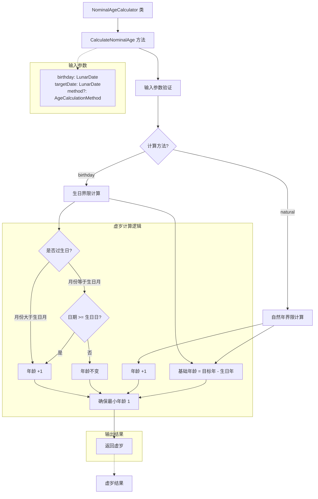
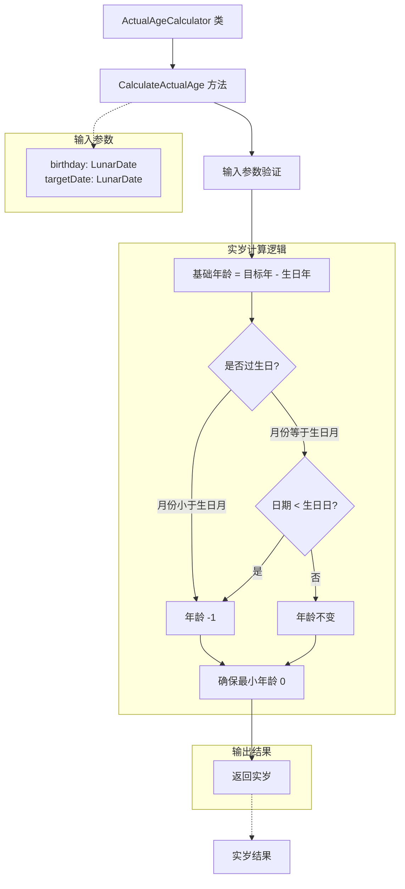
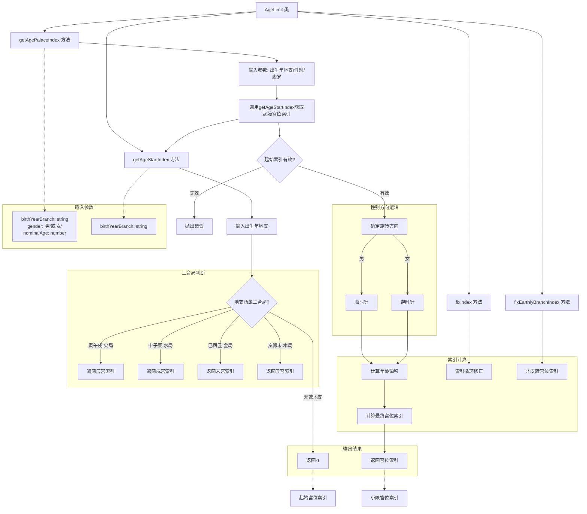

# 工具函数模块

包含以下功能：

## 目录结构

```
src/lib/utils/
├── date/                    # 日期相关工具
│   ├── DateFormatter.ts     # 日期格式化工具
│   ├── SolarToLunarConverter.ts # 阳历转农历转换器
│   └── LunarToSolarConverter.ts # 农历转阳历转换器
├── ganzhi/                  # 天干地支相关工具
│   ├── GanzhiAnalysis.ts    # 分析工具（阴阳属性、距离计算）
│   ├── GanzhiCalculation.ts # 计算工具（年月日时干支）
│   ├── GanzhiConstants.ts   # 常量定义
│   ├── GanzhiString.ts      # 字符串处理
│   ├── GanzhiValidation.ts  # 验证工具
│   └── GanZhiCalculator.ts  # 主集成类
├── age/                     # 年龄和运限工具
│   ├── AgeCalculation.ts    # 基础年龄计算（虚岁、实岁）
│   ├── AgeLimit.ts          # 小限计算
│   ├── DecadalLimit.ts      # 大限计算
│   ├── ChildhoodLimit.ts    # 童限计算
│   └── HoroscopeInfo.ts     # 运限信息整合
├── person_info/             # 个人信息工具
│   ├── ZodiacCalculator.ts  # 生肖计算器
│   ├── ConstellationCalculator.ts # 星座计算器
│   ├── FiveElementsCalculator.ts # 五行计算器
│   └── index.ts             # 个人信息工具导出
├── index.ts                 # 统一导出索引
└── README.md               # 本文档
```

## 功能说明

### 日期转换
#### **阳历转农历**

将公历日期转换为农历日期信息

```mermaid

```
#### **农历转阳历**

将农历日期转换为公历日期

```mermaid

```
#### **日期格式化**

标准化日期字符串处理

```mermaid

```
### 干支计算
#### **年干支**：

根据出生年份计算年干支

```mermaid

```
#### **月干支**

根据年干支和农历月份计算月干支

```mermaid

```
#### **日干支**

根据阳历日期计算日干支

```mermaid

```
#### **时干支**

根据日干支和出生时辰计算时干支

```mermaid

```
### 干支分析
#### **阴阳属性分析**

判断干支的阴阳属性

```mermaid

```
#### **距离计算**

计算两个干支之间的距离

```mermaid

```
#### **五行属性**

干支对应的五行属性分析

```mermaid

```
### 年龄计算
#### **虚岁计算**

传统虚岁年龄计算



#### **实岁计算**

实际年龄计算


#### **小限计算**

十年小限的计算和分析



#### **大限计算**

十年大限的计算和分析

```mermaid

```

#### **童限计算**

儿童时期运限计算

```mermaid

```

### 个人信息计算
#### **生肖计算**：根据阳历日期或年份计算生肖
```mermaid

```
#### **星座计算**：根据阳历日期计算西方星座
```mermaid

```
#### **生肖年份查询**：根据生肖查询对应年份范围
```mermaid

```
#### **星座日期范围**：查询各个星座的日期范围
```mermaid

```
### 运限分析
- **完整的运限信息整合**：综合年龄、大限、小限等信息
- **运限预测**：基于紫微斗数理论的运限预测

### 字符串处理
- **干支转字符串**：将干支对象转换为可读字符串
- **批量转换**：批量处理干支字符串转换

### 验证工具
- **干支有效性验证**：验证干支数据的正确性
- **日期格式验证**：验证输入日期的格式正确性
